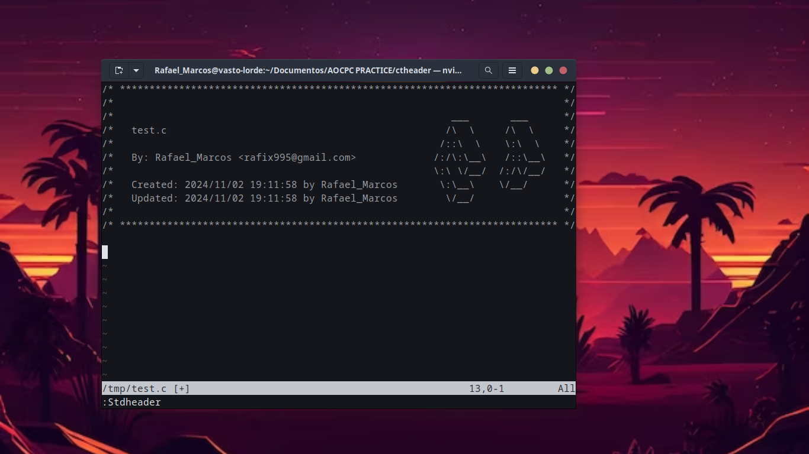

# **Code Titans Header**

### **Description**

Code Titans standard header for vim and nvim editors.
It takes username and email from git configurations.



### **UNIX Setup**

Copy `stdheader.vim` in your `~/.vim/plugin`, or use your favorite plugin
manager. Then set the user and mail variables as explained below.

#### Option 1: export USER and MAIL in your shell configuration file

Add in `~/.bashrc` (if you use bash) or `~/.zshrc` (if you use zsh) your:

+ `USER`
+ `MAIL`

#### Option 2: set user and mail values directly in your vimrc

This is a fork of 42 stdheader plugin, these instructions still valid

```vim
let g:user42 = 'name'
let g:mail42 = 'yourLogin@domain.ao'
```

### **Usage**

In **NORMAL** mode you can use `:Stdheader` or simply press the shortcut <kbd>F1</kbd>.

Under **Linux** you eventually need to disable the **help** shortcut of your **terminal** :

For **Terminator**, right click -> Preferences -> Shortcuts -> change help with something other than <kbd>F1</kbd>

### **Note**

You can run the script bellow to easily setup the plugin. If you do not use **bash**, modify the value of the `SHRC` variable in the script with the path of your shell configuration file.

`$ ./set_header.sh`

### **Credits**

[Original repository](https://github.com/42Paris/42header)

### **License**

This work is published under the terms of **[42 Unlicense](https://github.com/gcamerli/42unlicense)**.
